# 🤝 MeetIt

**MeetIt**, iki kullanıcının kişilik analizine göre birbirlerine uygun buluşma mekanları önerisinde bulunan sosyal bir Flutter uygulamasıdır. Arkadaşlarınla buluşmak için en uygun yeri bulmak artık çok kolay!

<p align="center">
  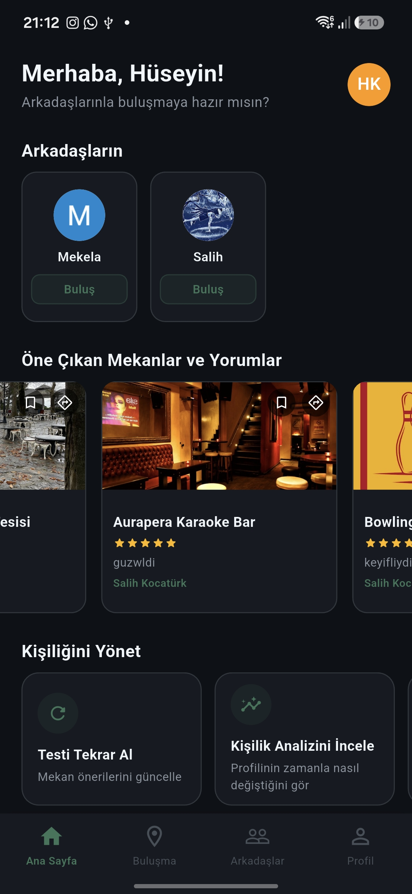
  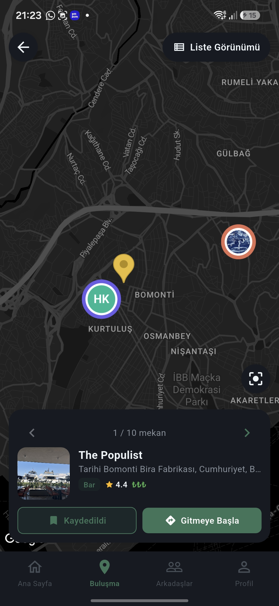
  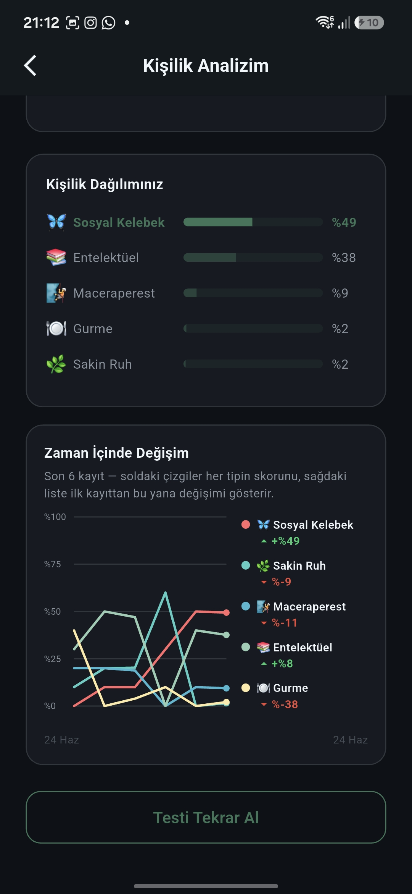
</p>

---

## ✨ Özellikler

- **Kişilik Analizi** — Trivia bazlı kısa bir testle 5 boyutlu kişilik profili (Sosyal Kelebek, Entelektüel, Maceraperest, Gurme, Sakin Ruh)
- **Akıllı Mekan Önerileri** — Her iki kullanıcının kişiliğine ve seçilen aktivite türlerine göre Google Places API üzerinden öneri
- **Çoklu Aktivite Seçimi** — Buluşma ararken kafe, restoran, bar, sinema, spor, müze gibi birden fazla aktivite türü aynı anda seçilebilir ve her iki tarafın kişiliğine göre birden çok mekan önerisi listelenir
- **Orta Nokta Hesaplama** — İki kullanıcının GPS konumu ortalaması alınarak en yakın buluşma noktası önce listelenir
- **Arkadaşlık Sistemi** — 6 haneli kod ile arkadaş ekleme, istek gönderme/kabul etme/iptal etme, akıllı arkadaş önerileri
- **Arkadaş Kişilik Uyumu** — Seninle bir arkadaşının kişilik profilini radar grafik üzerinde karşılaştırıp uyum yüzdesi gösteren sayfa
- **Kişilik Geçmişi** — Zaman içindeki kişilik değişimini çizgi grafikle gösteren "Kişilik Analizim" sayfası
- **Feed** — Mekan değerlendirmeleri (1–5 yıldız + yorum) feed'e otomatik düşer, yorumlar beğenilebilir
- **Profil Sayfası** — Instagram tarzı profil; gönderiler, kaydedilen mekanlar, tarif alınan mekanlar ve arkadaş sayısı
- **Realtime Veri** — Firestore `snapshots()` ile anlık güncellenen feed, arkadaşlar ve profil
- **Harita ile Konum Seçme** — Google Maps üzerinden parmakla sürükleyerek konum belirleme (kayıt, profil düzenleme ve buluşma ekranlarında)
- **Firebase Auth** — Email/şifre ile giriş, e-posta doğrulama akışı, SharedPreferences ile oturum kalıcılığı

---

## 🛠 Teknoloji Yığını

| Katman | Teknoloji |
|---|---|
| UI | Flutter 3 |
| State Management | Riverpod (NotifierProvider, StreamProvider) |
| Backend | Firebase (Auth, Firestore, Storage) |
| Haritalar | Google Maps Flutter + Places API + Geocoding API |
| Navigasyon | GoRouter |
| Kişilik Modeli | 5 boyutlu skor tabanlı profil + Kosinüs Benzerliği |
| Lokalizasyon | easy_localization (tr / en) |

---

## 📁 Proje Yapısı

```
lib/
├── core/
│   ├── constants/        # Renkler, temalar
│   ├── router/           # GoRouter tanımları
│   └── widgets/          # Ortak UI bileşenleri
├── features/
│   ├── auth/             # Giriş, kayıt, e-posta doğrulama, session
│   ├── feed/             # Gönderi akışı, mekan değerlendirme
│   ├── friends/          # Arkadaşlık sistemi, kod ile ekleme, uyum sayfası
│   ├── match/            # Buluşma önerileri, çoklu aktivite, mekan arama/harita
│   ├── personality/      # Kişilik testi, modeli ve analiz sayfaları
│   ├── profile/          # Profil sayfası, profil düzenleme
│   └── settings/         # Ayarlar, şifre değiştirme, dil/tema
└── main.dart
```

---

## 🚀 Kurulum

### Gereksinimler
- Flutter SDK `^3.10`
- Firebase projesi (Firestore, Auth, Storage etkin)
- Google Maps API anahtarı (Maps SDK + Places API + Geocoding API etkin)

### Adımlar

```bash
# 1. Depoyu klonla
git clone https://github.com/SalihKocaturk/meet-it.git
cd meet-it

# 2. Bağımlılıkları yükle
flutter pub get

# 3. Firebase yapılandırmasını ekle
# android/app/google-services.json  → Firebase Console'dan indir
# ios/Runner/GoogleService-Info.plist → Firebase Console'dan indir
# lib/firebase_options.dart → flutterfire configure ile oluştur

# 4. API anahtarlarını ayarla
# dart_defines.example.json dosyasını dart_defines.json olarak kopyala
# ve kendi Google Maps / Places API anahtarını gir

# 5. Uygulamayı çalıştır
flutter run
```

### Gizli Dosyalar (Git'e dahil edilmez)
Bu dosyaları kendin oluşturman gerekir:
```
android/app/google-services.json
ios/Runner/GoogleService-Info.plist
lib/firebase_options.dart
android/key.properties
android/secrets.properties
dart_defines.json
```

---

## 🔑 Firebase Güvenlik Kuralları (Firestore)

Temel okuma/yazma kuralı — production öncesi sıkılaştırılmalıdır:

```
rules_version = '2';
service cloud.firestore {
  match /databases/{database}/documents {
    match /{document=**} {
      allow read, write: if request.auth != null;
    }
  }
}
```

---

## 📸 Ekran Görüntüleri

### Ana Sayfa & Kişilik Testi

<table>
  <tr>
    <td align="center"><br/>Ana Sayfa</td>
    <td align="center">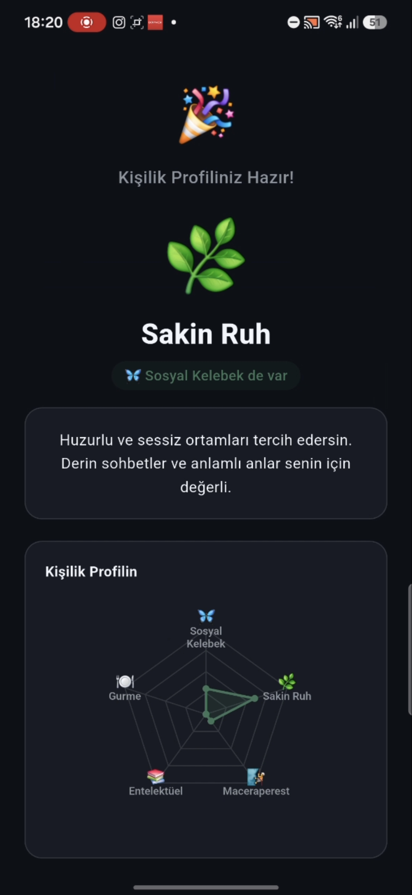<br/>Kişilik Testi Sonucu</td>
    <td align="center"><br/>Kişilik Analizim</td>
  </tr>
</table>

### Buluşma & Mekanlar

<table>
  <tr>
    <td align="center">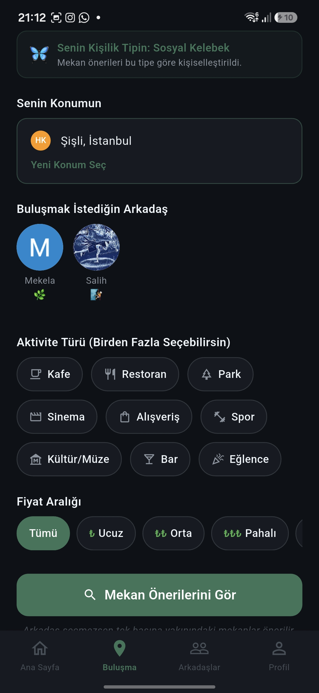<br/>Buluşma Yeri Bul (çoklu aktivite)</td>
    <td align="center"><br/>Harita Görünümü</td>
    <td align="center">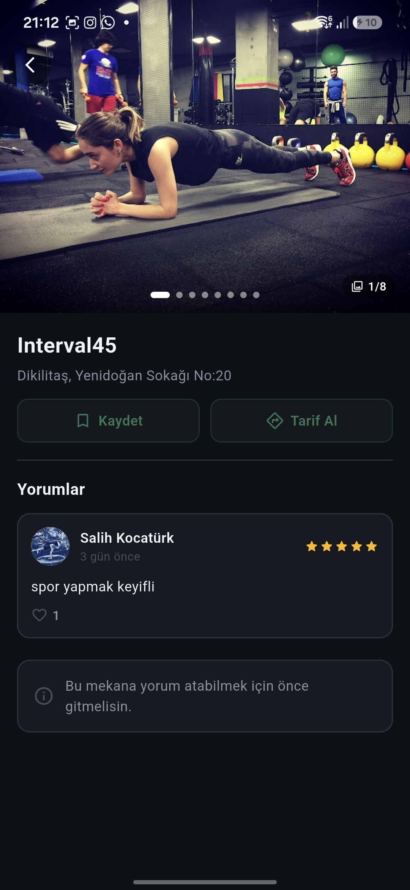<br/>Mekan Detayı</td>
  </tr>
</table>

### Arkadaşlar

<table>
  <tr>
    <td align="center">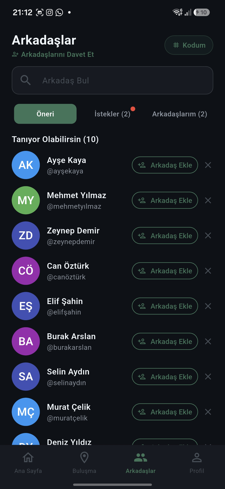<br/>Arkadaş Önerileri</td>
    <td align="center">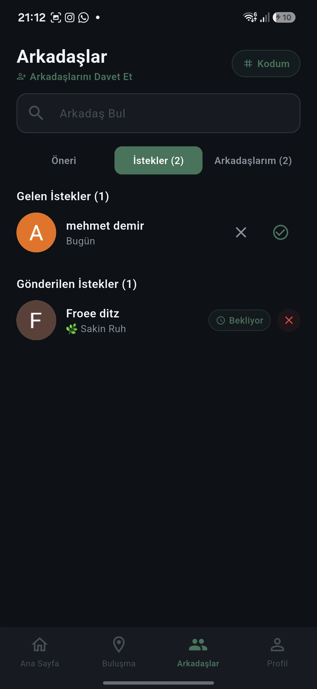<br/>İstekler</td>
    <td align="center">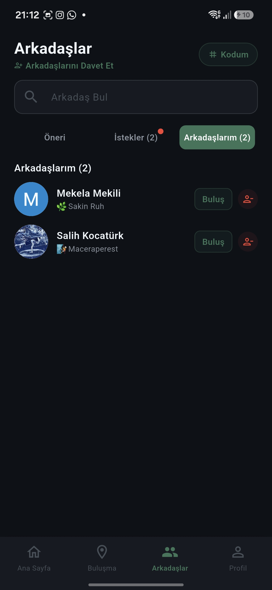<br/>Arkadaşlarım</td>
  </tr>
  <tr>
    <td align="center">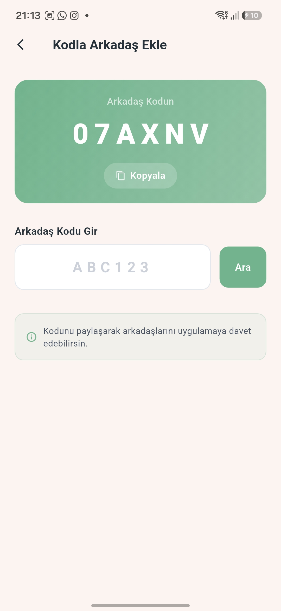<br/>Kodla Arkadaş Ekle</td>
    <td align="center">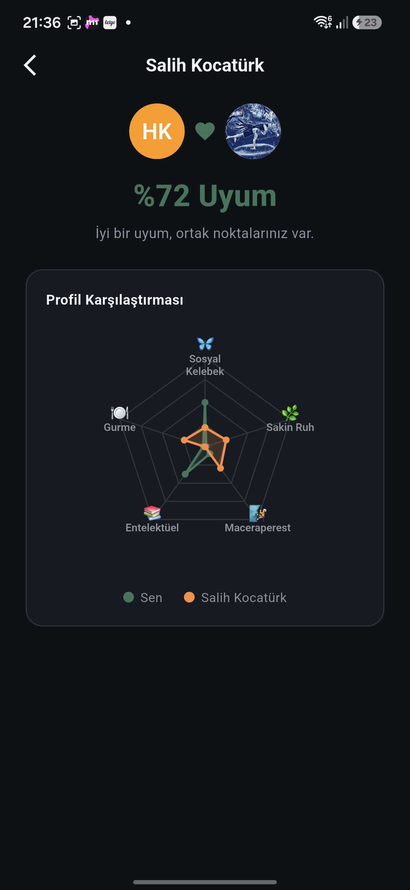<br/>Arkadaş Kişilik Uyumu</td>
    <td></td>
  </tr>
</table>

### Profil & Ayarlar

<table>
  <tr>
    <td align="center">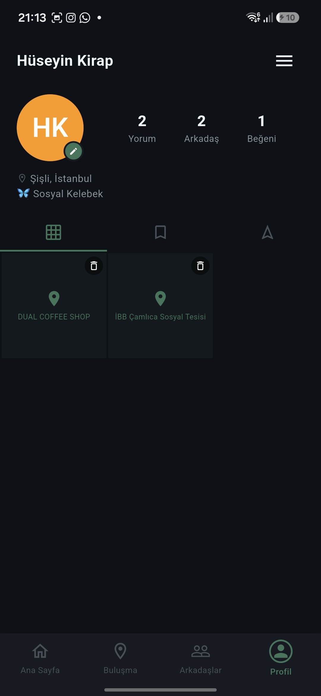<br/>Profil — Gönderiler</td>
    <td align="center">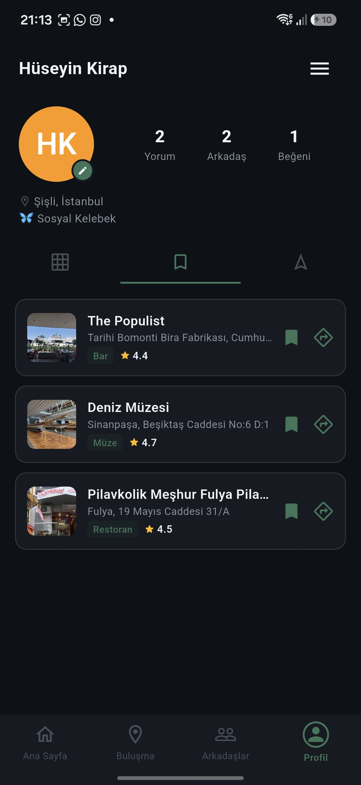<br/>Kaydedilen Mekanlar</td>
    <td align="center">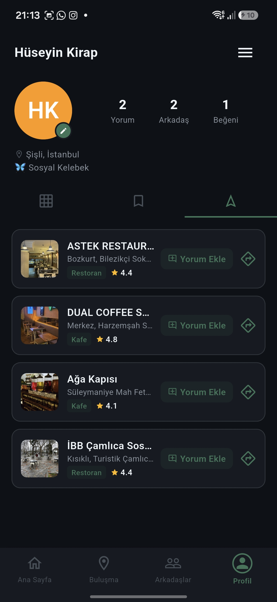<br/>Tarif Alınan Mekanlar</td>
  </tr>
  <tr>
    <td align="center">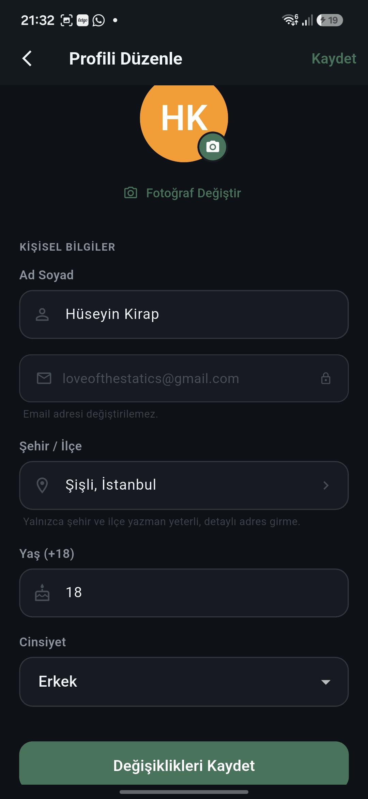<br/>Profili Düzenle</td>
    <td align="center">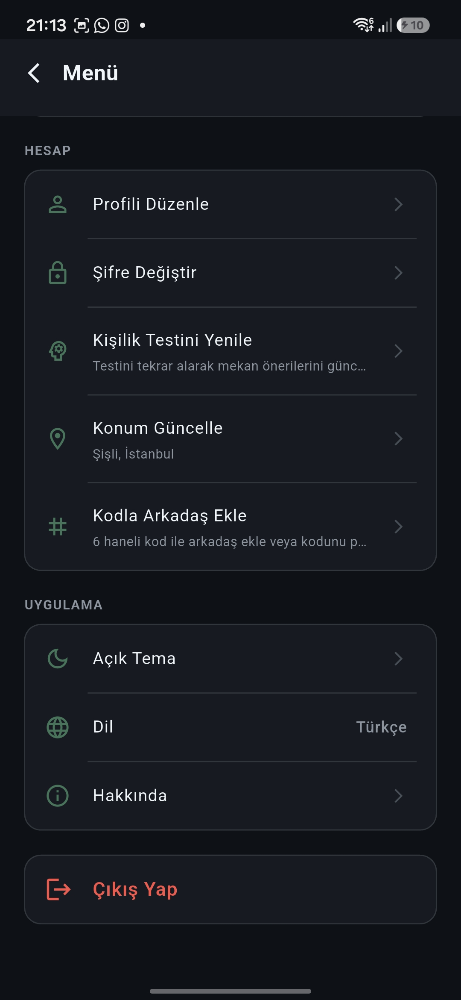<br/>Ayarlar (Koyu Tema)</td>
    <td align="center">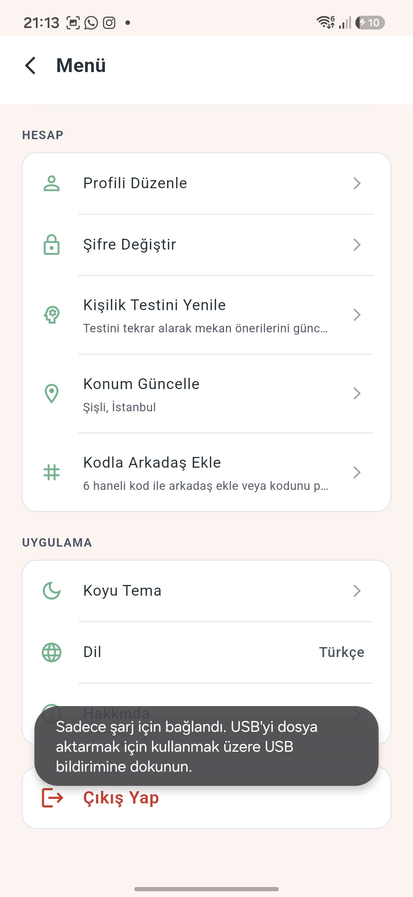<br/>Ayarlar (Açık Tema)</td>
  </tr>
</table>

---

## 📄 Lisans

Bu proje kişisel/öğrenci projesi olarak geliştirilmektedir. Lisans belirlenmemiştir.
