# 🤝 MeetIt

**MeetIt** is a social Flutter app that recommends meeting venues to two users based on their personality analysis. Finding the perfect spot to meet up with friends has never been easier!

<p align="center">
  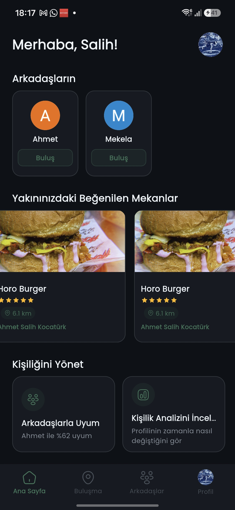
  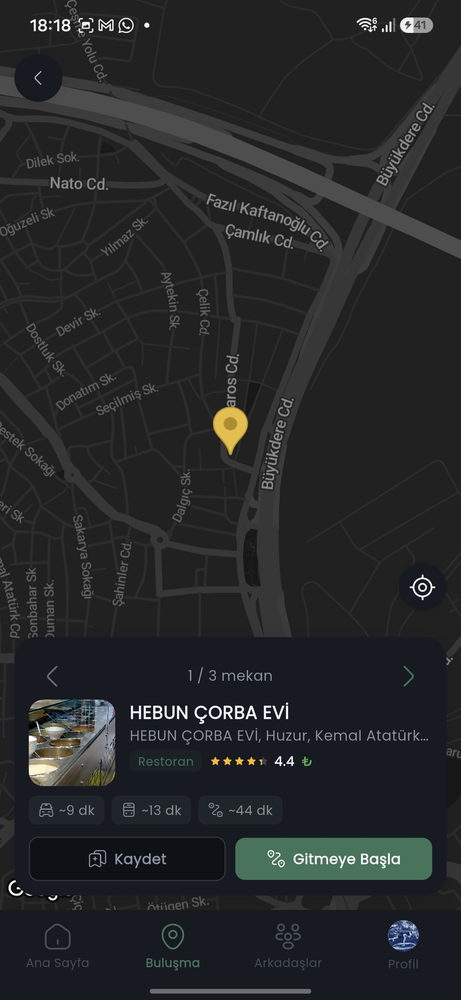
  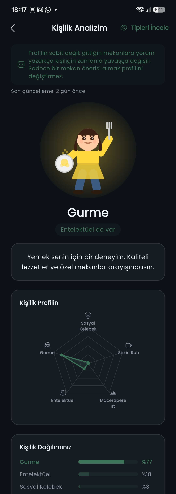
</p>

---

## ✨ Features

- **Personality Analysis** — A short trivia-based test produces a 5-dimensional personality profile (Social Butterfly, Intellectual, Adventurer, Gourmet, Calm Soul)
- **Smart Venue Recommendations** — Suggestions via the Google Places API based on both users' personalities and the selected activity types
- **Multi-Activity Selection** — When searching for a meeting spot, multiple activity types (cafe, restaurant, bar, cinema, sports, museum, etc.) can be selected at once, and multiple venue recommendations are listed based on both sides' personalities
- **Midpoint Calculation** — The two users' GPS locations are averaged so the closest meeting point is listed first
- **Friendship System** — Add friends via a 6-digit code, send/accept/cancel requests, smart friend suggestions
- **Friend Personality Compatibility** — A page comparing your personality profile with a friend's on a radar chart and showing a compatibility percentage
- **Personality History** — A "My Personality Analysis" page showing how your personality has changed over time on a line chart
- **Feed** — Venue reviews (1–5 stars + comment) automatically appear in the feed, and comments can be liked
- **Profile Page** — Instagram-style profile with posts, saved venues, venues you've gotten directions to, and friend count
- **Realtime Data** — Feed, friends, and profile update instantly via Firestore `snapshots()`
- **Map-Based Location Picking** — Pick a location by dragging a pin on Google Maps (used during sign-up, profile editing, and meeting setup)
- **Firebase Auth** — Email/password sign-in, email verification flow, session persistence with SharedPreferences

---

## 🛠 Tech Stack

| Layer | Technology |
|---|---|
| UI | Flutter 3 |
| State Management | Riverpod (NotifierProvider, StreamProvider) |
| Backend | Firebase (Auth, Firestore, Storage) |
| Maps | Google Maps Flutter + Places API + Geocoding API |
| Navigation | GoRouter |
| Personality Model | 5-dimensional score-based profile + Cosine Similarity |
| Localization | easy_localization (tr / en) |

---

## 📁 Project Structure

```
lib/
├── core/
│   ├── constants/        # Colors, themes
│   ├── router/           # GoRouter definitions
│   └── widgets/          # Shared UI components
├── features/
│   ├── auth/             # Sign-in, sign-up, email verification, session
│   ├── feed/             # Post feed, venue reviews
│   ├── friends/          # Friendship system, add by code, compatibility page
│   ├── match/            # Meeting recommendations, multi-activity, venue search/map
│   ├── personality/      # Personality quiz, model, and analysis pages
│   ├── profile/          # Profile page, profile editing
│   └── settings/         # Settings, change password, language/theme
└── main.dart
```

---

## 🚀 Setup

### Requirements
- Flutter SDK `^3.10`
- A Firebase project (with Firestore, Auth, Storage enabled)
- A Google Maps API key (with Maps SDK + Places API + Geocoding API enabled)

### Steps

```bash
# 1. Clone the repo
git clone https://github.com/SalihKocaturk/meet-it.git
cd meet-it

# 2. Install dependencies
flutter pub get

# 3. Add your Firebase configuration
# android/app/google-services.json  → download from the Firebase Console
# ios/Runner/GoogleService-Info.plist → download from the Firebase Console
# lib/firebase_options.dart → generate with flutterfire configure

# 4. Set up your API keys
# Copy dart_defines.example.json to dart_defines.json
# and fill in your own Google Maps / Places API key

# 5. Run the app
flutter run
```

### Secret Files (not included in Git)
You'll need to create these yourself:
```
android/app/google-services.json
ios/Runner/GoogleService-Info.plist
lib/firebase_options.dart
android/key.properties
android/secrets.properties
dart_defines.json
```

---

## 🔑 Firebase Security Rules (Firestore)

Basic read/write rule — should be tightened before going to production:

```
rules_version = '2';
service cloud.firestore {
  match /databases/{database}/documents {
    match /{document=**} {
      allow read, write: if request.auth != null;
    }
  }
}
```

---

## 📸 Screenshots

### Home & Personality Quiz

<table>
  <tr>
    <td align="center"><br/>Home Page</td>
    <td align="center">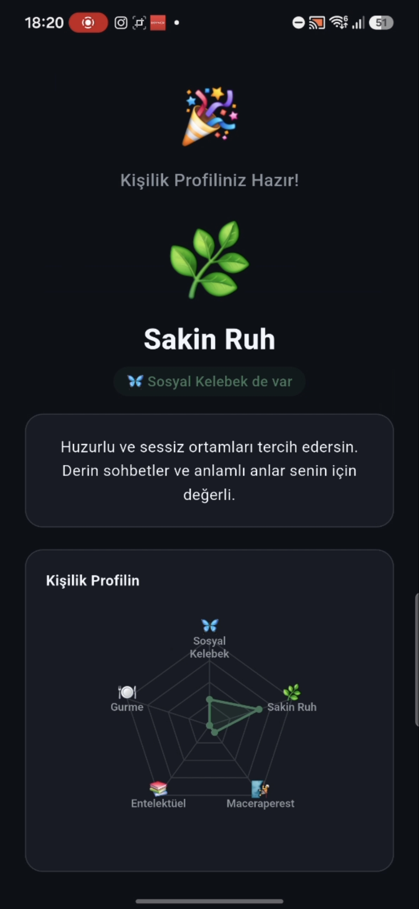<br/>Personality Quiz Result</td>
    <td align="center"><br/>My Personality Analysis</td>
  </tr>
</table>

### Meeting & Venues

<table>
  <tr>
    <td align="center">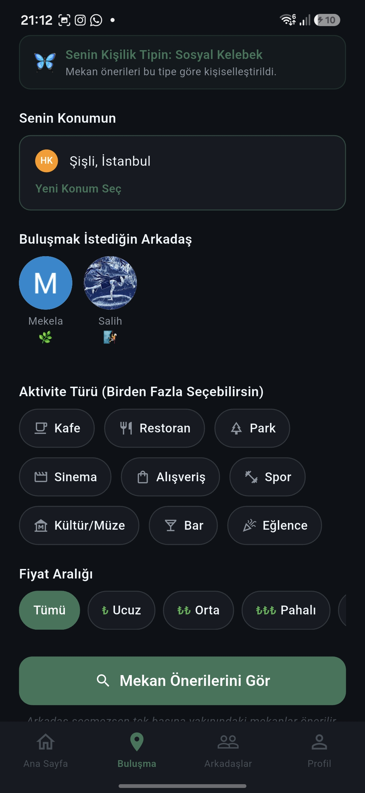<br/>Find a Meeting Spot (multi-activity)</td>
    <td align="center"><br/>Map View</td>
    <td align="center">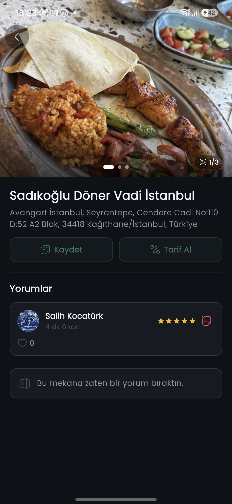<br/>Venue Detail</td>
  </tr>
</table>

### Friends

<table>
  <tr>
    <td align="center">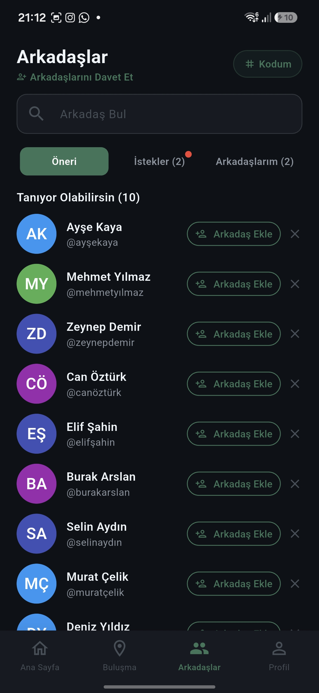<br/>Friend Suggestions</td>
    <td align="center">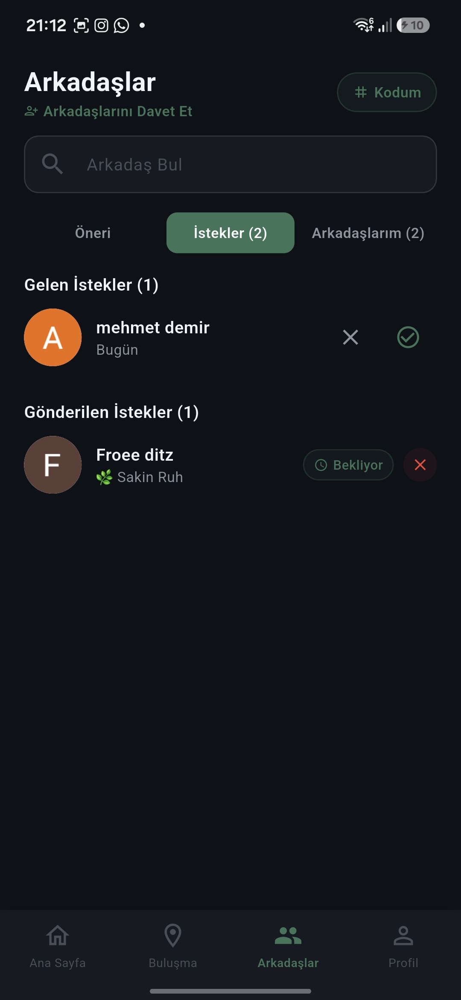<br/>Requests</td>
    <td align="center">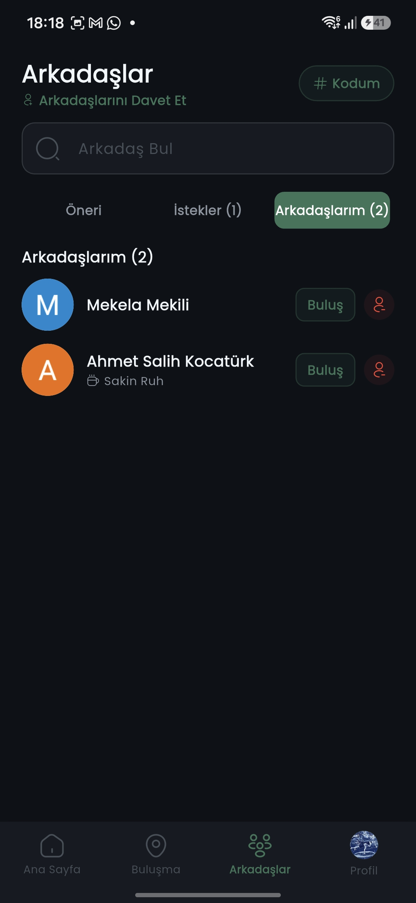<br/>My Friends</td>
  </tr>
  <tr>
    <td align="center">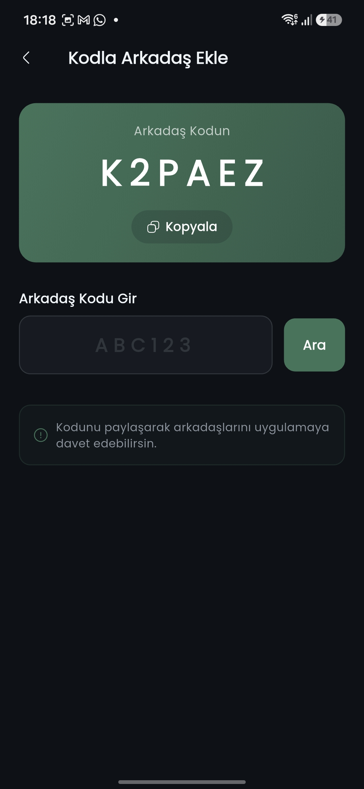<br/>Add Friend by Code</td>
    <td align="center">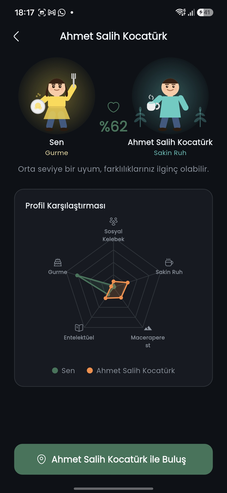<br/>Friend Personality Compatibility</td>
    <td></td>
  </tr>
</table>

### Profile & Settings

<table>
  <tr>
    <td align="center">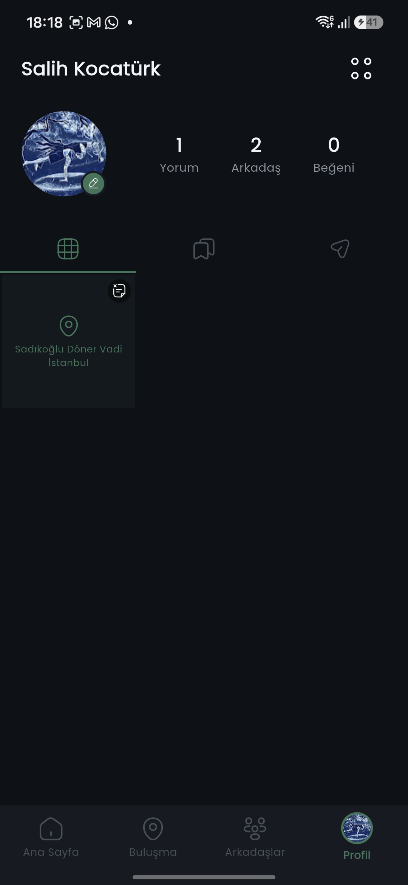<br/>Profile — Posts</td>
    <td align="center">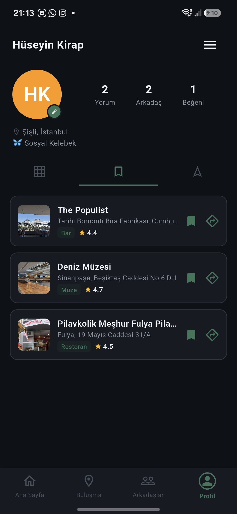<br/>Saved Venues</td>
    <td align="center">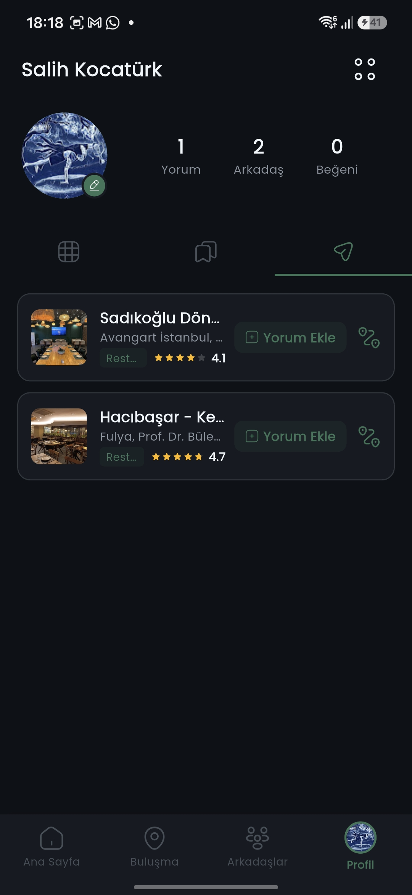<br/>Venues with Directions Taken</td>
  </tr>
  <tr>
    <td align="center">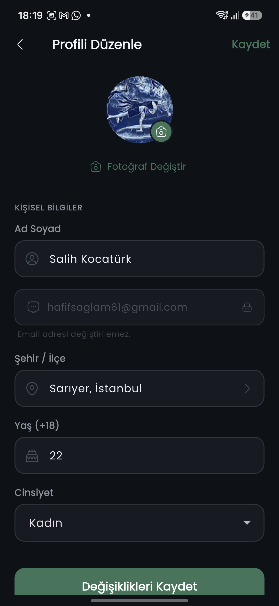<br/>Edit Profile</td>
    <td align="center">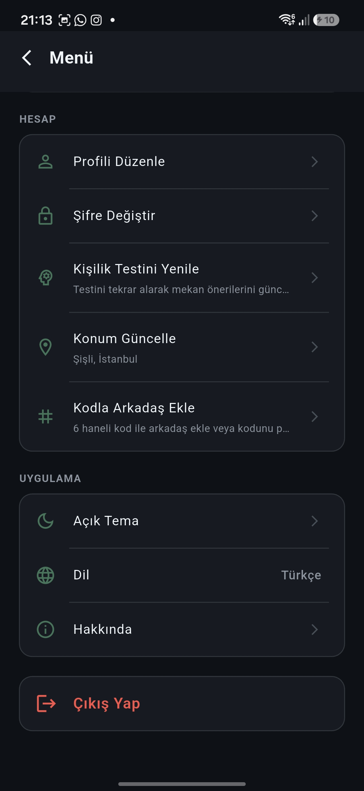<br/>Settings (Dark Theme)</td>
    <td align="center">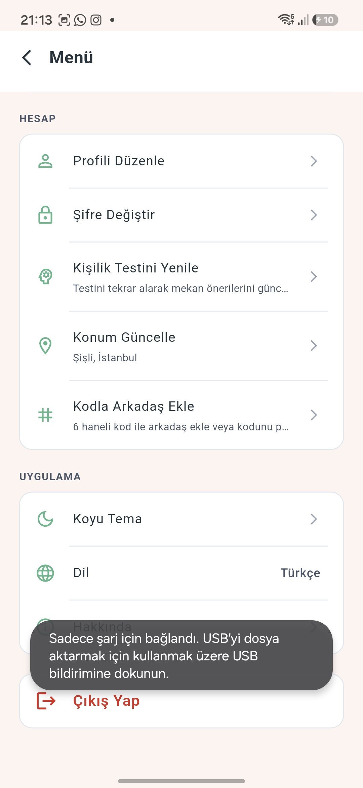<br/>Settings (Light Theme)</td>
  </tr>
</table>

---

## 📄 License

This project is being developed as a personal/student project. No license has been specified yet.
